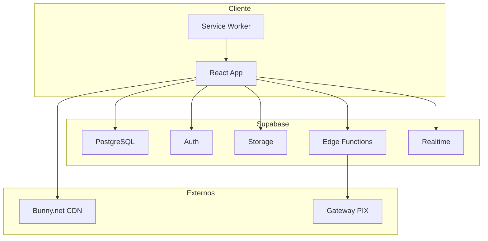
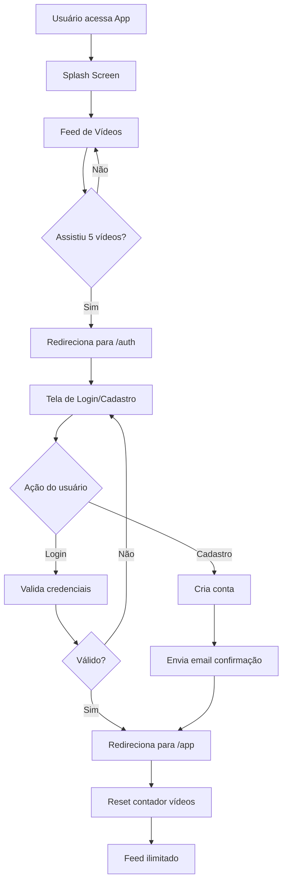
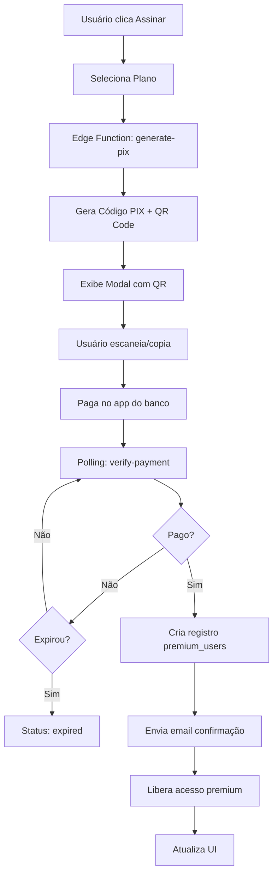
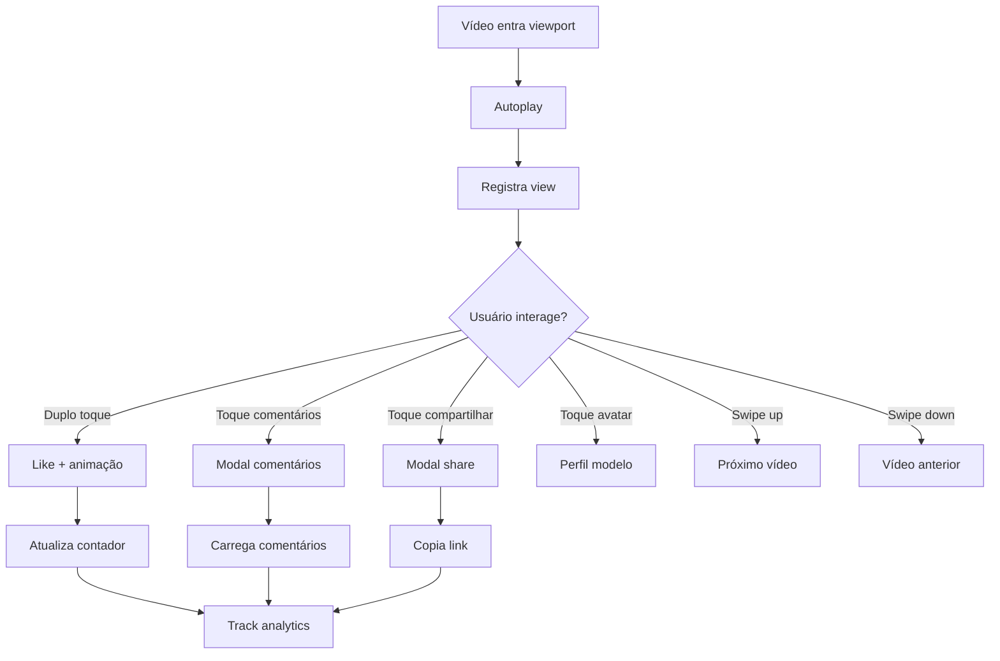
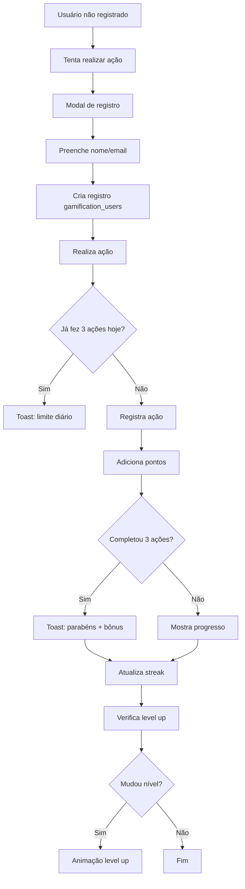
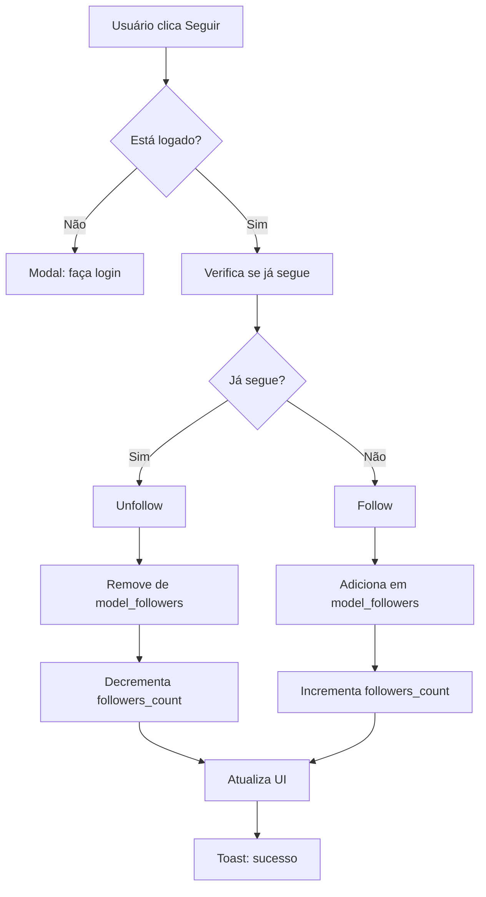

# 📋 PRD - Product Requirements Document
# COCONUDI - Plataforma de Vídeos Curtos

**Versão:** 2.0  
**Data:** 2025-11-24  
**Status:** ✅ Em Produção

---

## 📑 Índice

1. [Visão Geral do Produto](#1-visão-geral-do-produto)
2. [Arquitetura Técnica](#2-arquitetura-técnica)
3. [Estrutura de Dados](#3-estrutura-de-dados)
4. [Funcionalidades Principais](#4-funcionalidades-principais)
5. [Fluxos de Usuário](#5-fluxos-de-usuário)
6. [Sistema de Autenticação](#6-sistema-de-autenticação)
7. [Sistema de Gamificação](#7-sistema-de-gamificação)
8. [Sistema de Monetização](#8-sistema-de-monetização)
9. [Painel Administrativo](#9-painel-administrativo)
10. [Analytics e Tracking](#10-analytics-e-tracking)
11. [Performance e Otimizações](#11-performance-e-otimizações)
12. [Segurança e Permissões](#12-segurança-e-permissões)
13. [PWA e Mobile](#13-pwa-e-mobile)
14. [Roadmap](#14-roadmap)
15. [KPIs e Métricas](#15-kpis-e-métricas)

---

## 1. VISÃO GERAL DO PRODUTO

### 1.1 Resumo Executivo

**COCONUDI** é uma plataforma de vídeos curtos especializada em conteúdo de modelos, combinando um feed inteligente estilo TikTok com sistema de gamificação, monetização premium e ferramentas administrativas avançadas.

### 1.2 Objetivos do Produto

- ✅ Experiência fluida de consumo de vídeos verticais em formato mobile-first
- ✅ Maximizar engajamento através de feed inteligente e gamificação
- ✅ Monetizar através de assinaturas premium e marketplace integrado
- ✅ Fornecer ferramentas completas de gestão para administradores e modelos
- ✅ Criar economia sustentável com múltiplas fontes de receita

### 1.3 Público-Alvo

| Perfil | Descrição | Necessidades |
|--------|-----------|--------------|
| **Usuários Finais** | Maiores de 18 anos interessados em conteúdo de modelos | Conteúdo de qualidade, navegação fácil, interação social |
| **Modelos/Criadoras** | Criadoras de conteúdo que desejam monetizar | Ferramentas de upload, analytics, monetização |
| **Administradores** | Equipe responsável pela gestão da plataforma | Dashboard completo, moderação, analytics |
| **Anunciantes** | Empresas/negócios locais que desejam promover produtos | Visibilidade, ROI, analytics de campanha |

### 1.4 Diferenciais Competitivos

✨ **Feed Inteligente**: Algoritmo próprio de recomendação personalizada  
🎮 **Gamificação Completa**: Sistema de pontos, níveis, missões e recompensas  
💰 **Integração PIX**: Pagamento 100% brasileiro e instantâneo  
🎯 **Marketplace Integrado**: Loja de produtos dentro do app  
🗺️ **Negócios Locais**: Mapa interativo com comércios parceiros  
📊 **Painel Admin Robusto**: Controle total sobre a plataforma  
⚡ **Performance Mobile**: Otimizado para dispositivos móveis  

---

## 2. ARQUITETURA TÉCNICA

### 2.1 Stack Tecnológico

#### Frontend
```typescript
- React 18.3.1 + TypeScript 5.x
- Vite 5.x (Build Tool)
- Tailwind CSS 3.x + shadcn/ui
- Framer Motion 12.x (Animações)
- React Router DOM 6.x (Navegação)
- TanStack Query 5.x (State Management)
- React Leaflet 4.x (Mapas)
- Embla Carousel 8.x (Carousels)
```

#### Backend (BaaS - Supabase)
```
- PostgreSQL 15.x (Database)
- Supabase Auth (Authentication)
- Edge Functions (Deno Runtime)
- Real-time Subscriptions
- Storage (Arquivos e mídia)
- Row-Level Security (RLS)
```

#### Infraestrutura de Vídeos
```
- Bunny.net (CDN e Streaming)
  └── Streaming adaptativo
  └── Compressão otimizada
  └── Thumbnails automáticas
  └── Multi-bitrate
```

#### Pagamentos
```
- PIX (Sistema brasileiro)
  └── QR Code dinâmico
  └── Verificação automática
  └── Webhooks de confirmação
```

### 2.2 Estrutura de Diretórios

```
/
├── src/
│   ├── assets/              # Imagens, ícones, logos
│   ├── components/          # Componentes React
│   │   ├── admin/          # Componentes do painel admin
│   │   ├── tiktok/         # Componentes do feed
│   │   └── ui/             # Componentes UI (shadcn)
│   ├── hooks/              # React hooks customizados
│   ├── integrations/       # Integrações (Supabase)
│   ├── lib/                # Utilidades e helpers
│   ├── pages/              # Páginas da aplicação
│   ├── types/              # TypeScript types
│   └── utils/              # Funções utilitárias
├── supabase/
│   ├── functions/          # Edge Functions
│   ├── migrations/         # Migrations SQL
│   └── rls-security/       # Scripts de segurança RLS
└── public/                 # Arquivos estáticos
```

### 2.3 Arquitetura de Dados



---

## 3. ESTRUTURA DE DADOS

### 3.1 Tabelas Core

#### `videos`
```sql
CREATE TABLE videos (
  id UUID PRIMARY KEY DEFAULT gen_random_uuid(),
  title TEXT NOT NULL,
  description TEXT,
  video_url TEXT NOT NULL,
  thumbnail_url TEXT,
  thumbnail_locked TEXT,
  model_id UUID REFERENCES models(id),
  user_id UUID REFERENCES auth.users(id),
  likes_count INTEGER DEFAULT 0,
  comments_count INTEGER DEFAULT 0,
  shares_count INTEGER DEFAULT 0,
  views_count INTEGER DEFAULT 0,
  music_name TEXT,
  visibility TEXT DEFAULT 'public', -- 'public' | 'premium'
  is_active BOOLEAN DEFAULT true,
  created_at TIMESTAMP WITH TIME ZONE DEFAULT now(),
  updated_at TIMESTAMP WITH TIME ZONE DEFAULT now()
);
```

#### `models`
```sql
CREATE TABLE models (
  id UUID PRIMARY KEY DEFAULT gen_random_uuid(),
  username TEXT UNIQUE NOT NULL,
  email TEXT UNIQUE,
  avatar_url TEXT,
  bio TEXT,
  followers_count INTEGER DEFAULT 0,
  following_count INTEGER DEFAULT 0,
  is_online BOOLEAN DEFAULT false,
  posting_panel_url TEXT, -- URL do painel premium
  created_at TIMESTAMP WITH TIME ZONE DEFAULT now()
);
```

#### `profiles`
```sql
CREATE TABLE profiles (
  id UUID PRIMARY KEY REFERENCES auth.users(id),
  name TEXT,
  username TEXT UNIQUE,
  avatar_url TEXT,
  bio TEXT,
  email TEXT,
  created_at TIMESTAMP WITH TIME ZONE DEFAULT now(),
  updated_at TIMESTAMP WITH TIME ZONE DEFAULT now()
);
```

### 3.2 Tabelas de Interações

#### `likes`
```sql
CREATE TABLE likes (
  id UUID PRIMARY KEY DEFAULT gen_random_uuid(),
  user_id UUID REFERENCES profiles(id),
  video_id UUID REFERENCES videos(id),
  created_at TIMESTAMP WITH TIME ZONE DEFAULT now(),
  UNIQUE(user_id, video_id)
);
```

#### `comments`
```sql
CREATE TABLE comments (
  id UUID PRIMARY KEY DEFAULT gen_random_uuid(),
  user_id UUID REFERENCES profiles(id),
  video_id UUID REFERENCES videos(id),
  text TEXT NOT NULL,
  likes_count INTEGER DEFAULT 0,
  created_at TIMESTAMP WITH TIME ZONE DEFAULT now()
);
```

#### `video_views`
```sql
CREATE TABLE video_views (
  id UUID PRIMARY KEY DEFAULT gen_random_uuid(),
  user_id UUID REFERENCES profiles(id),
  video_id UUID REFERENCES videos(id),
  created_at TIMESTAMP WITH TIME ZONE DEFAULT now()
);
```

#### `model_followers`
```sql
CREATE TABLE model_followers (
  id UUID PRIMARY KEY DEFAULT gen_random_uuid(),
  user_id UUID REFERENCES profiles(id),
  model_id UUID REFERENCES models(id),
  is_active BOOLEAN DEFAULT true,
  created_at TIMESTAMP WITH TIME ZONE DEFAULT now(),
  UNIQUE(user_id, model_id)
);
```

### 3.3 Tabelas Premium & Monetização

#### `premium_users`
```sql
CREATE TABLE premium_users (
  id TEXT PRIMARY KEY,
  email TEXT NOT NULL,
  name TEXT,
  subscription_status TEXT DEFAULT 'active', -- 'active' | 'expired' | 'cancelled'
  subscription_start TIMESTAMP WITH TIME ZONE,
  subscription_end TIMESTAMP WITH TIME ZONE,
  amount_paid DECIMAL(10,2),
  created_at TIMESTAMP WITH TIME ZONE DEFAULT now()
);
```

#### `pix_payments`
```sql
CREATE TABLE pix_payments (
  id UUID PRIMARY KEY DEFAULT gen_random_uuid(),
  payment_id TEXT UNIQUE,
  pix_code TEXT NOT NULL,
  qr_code_base64 TEXT,
  amount DECIMAL(10,2) NOT NULL,
  status TEXT DEFAULT 'pending', -- 'pending' | 'paid' | 'expired'
  user_email TEXT,
  created_at TIMESTAMP WITH TIME ZONE DEFAULT now(),
  updated_at TIMESTAMP WITH TIME ZONE DEFAULT now()
);
```

#### `marketplace_products`
```sql
CREATE TABLE marketplace_products (
  id UUID PRIMARY KEY DEFAULT gen_random_uuid(),
  name TEXT NOT NULL,
  description TEXT,
  price DECIMAL(10,2) NOT NULL,
  image_url TEXT,
  category TEXT,
  stock INTEGER DEFAULT 0,
  average_rating DECIMAL(3,2) DEFAULT 0,
  total_reviews INTEGER DEFAULT 0,
  is_active BOOLEAN DEFAULT true,
  created_at TIMESTAMP WITH TIME ZONE DEFAULT now()
);
```

#### `marketplace_orders`
```sql
CREATE TABLE marketplace_orders (
  id UUID PRIMARY KEY DEFAULT gen_random_uuid(),
  user_id UUID REFERENCES profiles(id),
  product_id UUID REFERENCES marketplace_products(id),
  quantity INTEGER DEFAULT 1,
  total_price DECIMAL(10,2),
  status TEXT DEFAULT 'pending', -- 'pending' | 'paid' | 'shipped' | 'delivered'
  shipping_address JSONB,
  created_at TIMESTAMP WITH TIME ZONE DEFAULT now()
);
```

#### `model_subscriptions`
```sql
CREATE TABLE model_subscriptions (
  id UUID PRIMARY KEY DEFAULT gen_random_uuid(),
  user_id UUID REFERENCES profiles(id),
  model_id UUID REFERENCES models(id),
  subscription_value DECIMAL(10,2) NOT NULL,
  subscribed_at TIMESTAMP WITH TIME ZONE DEFAULT now(),
  renewal_date TIMESTAMP WITH TIME ZONE,
  is_active BOOLEAN DEFAULT true,
  payment_frequency TEXT DEFAULT 'monthly' -- 'monthly' | 'quarterly' | 'yearly'
);
```

### 3.4 Tabelas Gamificação

#### `gamification_users`
```sql
CREATE TABLE gamification_users (
  id TEXT PRIMARY KEY,
  name TEXT,
  email TEXT,
  total_points INTEGER DEFAULT 0,
  current_streak INTEGER DEFAULT 0,
  level_name TEXT DEFAULT 'Bronze',
  created_at TIMESTAMP WITH TIME ZONE DEFAULT now()
);
```

#### `gamification_actions`
```sql
CREATE TABLE gamification_actions (
  id UUID PRIMARY KEY DEFAULT gen_random_uuid(),
  user_id TEXT REFERENCES gamification_users(id),
  action_type TEXT NOT NULL, -- 'like' | 'comment' | 'share' | 'view' | 'message'
  video_id UUID REFERENCES videos(id),
  model_id UUID REFERENCES models(id),
  points_earned INTEGER DEFAULT 0,
  ip_address TEXT,
  user_agent TEXT,
  created_at TIMESTAMP WITH TIME ZONE DEFAULT now()
);
```

#### `daily_missions`
```sql
CREATE TABLE daily_missions (
  id UUID PRIMARY KEY DEFAULT gen_random_uuid(),
  title TEXT NOT NULL,
  description TEXT,
  mission_type TEXT NOT NULL,
  points_reward INTEGER DEFAULT 0,
  is_active BOOLEAN DEFAULT true,
  created_at TIMESTAMP WITH TIME ZONE DEFAULT now()
);
```

### 3.5 Tabelas Agendamento & Posts

#### `posts_agendados`
```sql
CREATE TABLE posts_agendados (
  id UUID PRIMARY KEY DEFAULT gen_random_uuid(),
  modelo_id UUID REFERENCES models(id),
  modelo_username TEXT,
  titulo TEXT NOT NULL,
  descricao TEXT,
  url_video TEXT NOT NULL,
  data_publicacao TIMESTAMP WITH TIME ZONE NOT NULL,
  status TEXT DEFAULT 'agendado', -- 'agendado' | 'publicado' | 'cancelado'
  thumbnail_url TEXT,
  created_at TIMESTAMP WITH TIME ZONE DEFAULT now()
);
```

### 3.6 Tabelas Negócios Locais

#### `local_businesses`
```sql
CREATE TABLE local_businesses (
  id UUID PRIMARY KEY DEFAULT gen_random_uuid(),
  name TEXT NOT NULL,
  description TEXT,
  category TEXT,
  address TEXT NOT NULL,
  phone TEXT,
  website TEXT,
  latitude DECIMAL(10,8) NOT NULL,
  longitude DECIMAL(11,8) NOT NULL,
  rating DECIMAL(3,2),
  image_url TEXT,
  is_active BOOLEAN DEFAULT true,
  created_at TIMESTAMP WITH TIME ZONE DEFAULT now()
);
```

### 3.7 Tabelas Roles & Segurança

#### `app_role` (ENUM)
```sql
CREATE TYPE app_role AS ENUM ('admin', 'moderator', 'user', 'creator');
```

#### `user_roles`
```sql
CREATE TABLE user_roles (
  id UUID PRIMARY KEY DEFAULT gen_random_uuid(),
  user_id UUID REFERENCES auth.users(id) ON DELETE CASCADE,
  role app_role NOT NULL,
  created_at TIMESTAMP WITH TIME ZONE DEFAULT now(),
  UNIQUE(user_id, role)
);
```

#### `creator_applications`
```sql
CREATE TABLE creator_applications (
  id UUID PRIMARY KEY DEFAULT gen_random_uuid(),
  user_id UUID REFERENCES auth.users(id),
  name TEXT,
  email TEXT,
  whatsapp TEXT,
  nickname TEXT,
  bio TEXT,
  gender TEXT,
  terms_accepted BOOLEAN DEFAULT false,
  image_rights_accepted BOOLEAN DEFAULT false,
  status TEXT DEFAULT 'pending', -- 'pending' | 'approved' | 'rejected'
  rejection_reason TEXT,
  created_at TIMESTAMP WITH TIME ZONE DEFAULT now(),
  updated_at TIMESTAMP WITH TIME ZONE DEFAULT now()
);
```

### 3.8 Tabelas Coleções

#### `user_favorites`
```sql
CREATE TABLE user_favorites (
  id UUID PRIMARY KEY DEFAULT gen_random_uuid(),
  user_id UUID REFERENCES auth.users(id),
  video_id UUID REFERENCES videos(id),
  created_at TIMESTAMP WITH TIME ZONE DEFAULT now(),
  UNIQUE(user_id, video_id)
);
```

---

## 4. FUNCIONALIDADES PRINCIPAIS

### 4.1 Feed de Vídeos (TikTok-Style)

#### Características Implementadas
- ✅ Scroll vertical infinito com Embla Carousel
- ✅ Autoplay ao entrar na viewport
- ✅ Player customizado com controles minimalistas
- ✅ Transições suaves entre vídeos (20ms duration)
- ✅ Pré-carregamento inteligente (próximos 2, anterior 1)
- ✅ Indicador de progresso do vídeo
- ✅ Suporte para vídeos de Bunny.net CDN
- ✅ Controle de áudio (mute/unmute)
- ✅ Pause/play por toque simples

#### Controles do Player
```typescript
// Gestos implementados
- Duplo toque → Like + animação de coração
- Toque simples → Pause/Play
- Swipe up → Próximo vídeo
- Swipe down → Vídeo anterior
- Botão volume → Mute/Unmute
- Barra progresso → Interativa
```

#### Layout Mobile
```
┌─────────────────────┐
│ [Logo] [🔍]         │ ← Header transparente
│                     │
│    VÍDEO FULL      │
│    SCREEN          │
│    (9:16)          │
│                     │
│  [@username]       │ ← Info do modelo
│  [descrição]       │
│  [🎵 música]       │
│                     │
│              [👤]  │ ← Avatar (75x75)
│              [❤]   │ ← Curtir
│              [💬]  │ ← Comentários
│              [↗]   │ ← Compartilhar
│              [⋮]   │ ← Opções
│                     │
└─[🏠][🔍][⊕][🛍][👤]─┘ ← Bottom Nav
```

### 4.2 Sistema de Feed Inteligente

#### Algoritmo de Recomendação

```typescript
interface FeedConfig {
  maxVideos: 50,
  mixRatio: {
    novos: 40%,      // Vídeos recentes (últimos 7 dias)
    favoritos: 30%,  // Modelos seguidas
    aleatorios: 30%  // Descoberta
  },
  scoreWeights: {
    novidade: 40%,
    afinidade: 30%,
    popularidade: 20%,
    aleatoriedade: 10%
  }
}
```

#### Score de Vídeo
```typescript
score = (novidade * 0.4) + 
        (afinidade * 0.3) + 
        (popularidade * 0.2) + 
        (random * 0.1)

onde:
- novidade = dias desde postagem (máx 7 dias)
- afinidade = seguir modelo (0 ou 1)
- popularidade = (likes + views + comments) / 1000
- random = Math.random()
```

#### Memória do Usuário (LocalStorage)
```typescript
interface UserMemory {
  videos_vistos: string[];           // IDs de vídeos já assistidos
  modelos_vistas: string[];          // IDs de modelos já exibidas
  modelos_favoritas: string[];       // IDs de modelos seguidas
  ultimo_video_modelo: Record<string, string>; // último vídeo de cada modelo
  sessao_atual: string;              // ID único da sessão
  ultima_atualizacao: string;        // Timestamp
}
```

### 4.3 Sistema de Interações

#### Curtidas (Likes)
```typescript
✅ Toggle de like com animação
✅ Contador em tempo real
✅ Duplo toque para curtir (TikTok style)
✅ Registro na tabela likes
✅ Tracking de analytics
✅ Prevenção de spam (3 ações/dia sem login)
```

#### Comentários
```typescript
✅ Modal full-screen
✅ Scroll infinito
✅ Likes em comentários
✅ Avatar + username do autor
✅ Timestamp relativo ("há 2 horas")
✅ Input persistente
✅ Ordenação por recente
```

#### Compartilhamentos
```typescript
✅ Modal com opções:
  - Copiar link
  - WhatsApp
  - Twitter
  - Facebook
✅ Incremento de contador
✅ Tracking de analytics
```

#### Visualizações
```typescript
✅ Tracking automático ao assistir
✅ Registro de timestamp
✅ Verificação de viewport
✅ Contador em tempo real
✅ Prevenção de duplicatas
```

### 4.4 Sistema Premium/VIP

#### Tipos de Conteúdo
```sql
visibility = 'public' | 'premium'
```

#### Controle de Acesso (Hierarquia)
```typescript
1. Usuário VIP → Acesso total
2. Usuário Registrado → Acesso temporário (até 5 vídeos)
3. Vídeo Desbloqueado → Acesso específico (localStorage)
4. Modelo Desbloqueada → Todos vídeos da modelo
```

#### Funcionalidades Premium
- ✅ Vídeos exclusivos premium
- ✅ Acesso a perfis completos das modelos
- ✅ Painéis personalizados (posting_panel_url)
- ✅ Sem limite de visualizações
- ✅ Suporte prioritário
- ✅ Badge VIP no perfil

#### Modal de Premium
```typescript
Conteúdo do Modal:
- 🎯 Benefícios claros
- 💎 Planos (mensal, trimestral, anual)
- 💰 Preços destacados
- ✅ Call-to-action primário
- 💳 Integração PIX
```

### 4.5 Sistema de Gamificação

#### Estrutura de Pontos
```typescript
Ações Pontuáveis:
- Like: 5 pontos
- Comentário: 10 pontos
- Compartilhamento: 15 pontos
- Visualização: 2 pontos
- Mensagem: 8 pontos

Limite Diário: 3 ações completas/dia
Reset: Meia-noite (00:00 BRT)
```

#### Níveis (Levels)
```typescript
interface Level {
  name: string;
  minPoints: number;
  maxPoints: number;
  badge: string;
}

Níveis:
- Bronze (0-100 pts) 🥉
- Prata (101-500 pts) 🥈
- Ouro (501-1000 pts) 🥇
- Platina (1001-2000 pts) 💎
- Diamante (2001+ pts) 💠
```

#### Missões Diárias
```typescript
interface DailyMission {
  title: string;
  description: string;
  mission_type: 'like' | 'comment' | 'share' | 'view';
  points_reward: number;
  is_active: boolean;
}

Exemplos:
- "Dê 3 likes hoje" → 15 pontos
- "Comente em 2 vídeos" → 20 pontos
- "Compartilhe 1 vídeo" → 15 pontos
```

#### Streak (Sequência)
```typescript
- Contador de dias consecutivos
- Bônus por manter streak (2x pontos após 7 dias)
- Reset ao perder um dia
- Badge especial para 30 dias
```

### 4.6 Sistema de Ofertas no Vídeo

#### Estrutura de Oferta
```typescript
interface Offer {
  id: string;
  title: string;
  description: string;
  model_id?: string;
  video_id?: string;
  button_text: string;
  button_color: string;
  button_link: string;
  start_at: timestamp;     // Quando aparece no vídeo (segundos)
  end_at: timestamp;       // Validade da oferta
  duration_seconds: number; // Quanto tempo fica na tela
  show_times: number;      // Quantas vezes exibir
  is_active: boolean;
}
```

#### Fluxo de Exibição
```
1. Vídeo inicia
2. Timer chega em start_at segundos
3. Modal de oferta aparece
4. Opções do usuário:
   a) Clicar no botão → Navega para link
   b) Fechar → Marca como dismissed (localStorage)
   c) Ignorar → Fecha após duration_seconds
5. Oferta não aparece mais para esse usuário
```

### 4.7 Painel Administrativo

#### Seções do Admin

##### 📊 Home/Dashboard
```typescript
- Estatísticas em tempo real
- Gráficos de crescimento
- KPIs principais:
  * Usuários ativos (DAU/MAU)
  * Vídeos assistidos
  * Taxa de engajamento
  * Receita do dia/mês
- Mapa do Brasil com dados por estado
- Notificações de vendas em tempo real
- Quick actions (botões rápidos)
```

##### 👥 Usuários
```typescript
- Lista completa de usuários
- Filtros e busca
- Status online/offline (real-time)
- Dados de gamificação (pontos, nível)
- E-mails para comunicação
- Roles (admin, moderator, user, creator)
- Ações:
  * Editar usuário
  * Suspender/Banir
  * Promover a admin
  * Ver histórico
```

##### 🎬 Vídeos
```typescript
- Gerenciamento de vídeos
- Upload para Bunny.net
- Campos:
  * Título, descrição
  * URL do vídeo (Bunny.net)
  * Thumbnail normal + locked
  * Associação com modelo
  * Visibilidade (public/premium)
  * Música
- Ações:
  * Ativar/desativar
  * Editar
  * Excluir
  * Preview
  * Ver analytics
```

##### 📅 Posts Agendados
```typescript
- Sistema de agendamento
- Calendário visual (react-day-picker)
- Status: agendado/publicado/cancelado
- Publicação automática via Edge Function (cron)
- Preview de vídeos
- Campos:
  * Título, descrição
  * URL do vídeo
  * Data/hora de publicação
  * Modelo associada
  * Thumbnail
```

##### 💎 Premium
```typescript
- Gestão de assinantes VIP
- Lista de transações
- Status de pagamentos PIX:
  * Pending (aguardando)
  * Paid (confirmado)
  * Expired (expirado)
- Histórico de transações
- Renovações e cancelamentos
- Filtros por status
- Busca por email/nome
```

##### 🎮 Gamificação
```typescript
- Configuração de missões diárias
- Ajuste de pontos por ação
- Visualização de rankings:
  * Top usuários por pontos
  * Maiores streaks
  * Mais ativos
- Estatísticas de engajamento
- Ações em massa:
  * Resetar pontos
  * Dar bônus
  * Criar eventos
```

##### 🎁 Ofertas
```typescript
- Criação de ofertas
- Associação com vídeos/modelos
- Configuração de timings:
  * Quando aparece (segundos)
  * Duração na tela
  * Validade
- Preview e testes
- Analytics de conversão
- Botão customizado:
  * Texto
  * Cor
  * Link de destino
```

##### 👤 Roles (Funções)
```typescript
- Gerenciamento de roles
- Adicionar/remover admins
- Adicionar/remover moderadores
- Permissões por role:
  * Admin: acesso total
  * Moderator: moderação de conteúdo
  * Creator: upload de vídeos
  * User: acesso básico
- Log de auditoria de mudanças
- Proteção: não pode remover último admin
```

##### 🎨 Aplicações de Criadores
```typescript
- Listagem de aplicações
- Filtros: pending/approved/rejected
- Detalhes completos:
  * Nome, email, WhatsApp
  * Nickname, biografia
  * Sexo
  * Termos aceitos
- Ações:
  * Aprovar → adiciona role 'creator'
  * Rejeitar → salva motivo
  * Ver perfil
- Notificações por email
```

##### ⚙ Configurações
```typescript
- Integrações:
  * Bunny.net (CDN)
  * PIX Gateway
  * SMTP (emails)
  * SMS
- Webhooks:
  * Configurar URLs
  * Testar endpoints
  * Ver logs
- E-mails de notificação:
  * Templates
  * Configurar SMTP
- SMS:
  * Provider
  * Créditos
- Backup/Restore
- Configurações gerais do app
```

##### 📚 Documentação
```typescript
- Guias de uso do painel
- API documentation
- Troubleshooting
- FAQs
- Changelog
- Vídeos tutoriais
```

### 4.8 Sistema de Busca

#### Busca Global
```typescript
Busca por:
- Título de vídeo
- Descrição de vídeo
- Nome de modelo
- Username de modelo
- Tags/hashtags

Features:
- ✅ Modal de busca
- ✅ Resultados em tempo real (debounce 300ms)
- ✅ Histórico de buscas (localStorage)
- ✅ Sugestões automáticas
- ✅ Filtros avançados
```

#### Categorias e Filtros
```typescript
Categorias:
- 🔥 Em Alta (trending)
- 🆕 Novos (recentes)
- 💎 Premium (VIP)
- ❤️ Seguindo (modelos seguidas)

Ordenação:
- Mais recente
- Mais popular (likes)
- Mais visto (views)
- Mais comentado
```

### 4.9 Perfis de Modelos

#### Tela de Perfil
```
┌─────────────────────┐
│    [← Voltar]      │
│                     │
│   [Avatar 120x120]  │
│   [@username]       │
│   [Bio da modelo]   │
│                     │
│ [1.2k] [340] [15]  │ ← Seguidores/Seguindo/Vídeos
│                     │
│  [🔥 Seguir]       │ ← Botão primário
│  [💬 Mensagem]     │ ← Botão secundário
│  [🔗 Painel VIP]   │ ← Se premium
│                     │
├─────────────────────┤
│   VÍDEOS (Grid)    │
│  [📹][📹][📹]      │
│  [📹][📹][📹]      │
│                     │
└─────────────────────┘
```

#### Funcionalidades
```typescript
✅ Seguir/deixar de seguir
✅ Contador de seguidores (real-time)
✅ Status online/offline (indicador verde)
✅ Link para painel personalizado (se premium)
✅ Grade de vídeos (3 colunas mobile, 4+ desktop)
✅ Filtros: Todos / Premium / Populares
✅ Botão "Enviar Mensagem"
✅ Estatísticas da modelo
```

### 4.10 Página de Exploração

#### Layout (Grid de Vídeos)
```typescript
Desktop: 5 colunas
Tablet: 3 colunas
Mobile: 3 colunas

Grid Item:
- Thumbnail do vídeo
- Overlay com stats ao hover:
  * Views
  * Likes
  * Comments
- Botão favoritar (coração)
- Badge de duração
- Badge premium (se aplicável)
```

#### Funcionalidades
```typescript
✅ Grid responsivo de thumbnails
✅ Hover mostra estatísticas
✅ Click abre vídeo em fullscreen
✅ Botão favoritar integrado
✅ Lazy loading de imagens
✅ Scroll infinito
```

### 4.11 Página Seguindo

#### Layout
```typescript
Grid Cards de Modelos:
- Avatar grande como background
- Overlay gradient
- Nome + username
- Contador de seguidores
- Badge VIP (se aplicável)
- Hover effect: scale + glow
```

#### Funcionalidades
```typescript
✅ Lista de modelos seguidas
✅ Cards visuais atrativos
✅ Click vai para perfil da modelo
✅ Status online/offline
✅ Ordenação: recentes, populares, alfabético
✅ Filtros: todas, apenas online, VIP
✅ Estado vazio: "Siga modelos para vê-las aqui"
```

### 4.12 Marketplace

#### Estrutura
```typescript
- Header sticky com voltar
- Filtros por categoria
- Grid de produtos:
  * Imagem do produto
  * Nome
  * Preço
  * Rating (estrelas)
  * Badge "Esgotado" se necessário
```

#### Funcionalidades
```typescript
✅ Listagem de produtos
✅ Filtros por categoria
✅ Busca de produtos
✅ Modal de detalhes do produto
✅ Sistema de avaliações (1-5 estrelas)
✅ Carrinho de compras
✅ Checkout com PIX
✅ Histórico de pedidos
```

#### Fluxo de Compra
```
1. Usuário navega produtos
2. Clica em produto → Modal detalhes
3. Clica "Comprar" → Modal checkout
4. Preenche dados de envio
5. Clica "Pagar com PIX"
6. Edge Function gera PIX
7. Exibe QR Code
8. Aguarda confirmação (webhook)
9. Atualiza status pedido → "paid"
10. Notifica usuário
```

### 4.13 Negócios Locais

#### Mapa Interativo
```typescript
Tecnologia: React Leaflet + OpenStreetMap

Features:
✅ Mapa interativo
✅ Marcadores dos negócios
✅ Marcador da localização do usuário
✅ Click no marcador → Popup com detalhes
✅ Busca de negócios
✅ Filtros por categoria
✅ Rotas (integração Google Maps)
```

#### Detalhes do Negócio
```typescript
- Nome
- Categoria
- Descrição
- Endereço
- Telefone
- Website
- Rating (estrelas)
- Imagem
- Botão "Como chegar" (Google Maps)
```

### 4.14 Coleções (Favoritos)

#### Funcionalidades
```typescript
✅ Salvar vídeos favoritos
✅ Grid de thumbnails
✅ Remover dos favoritos
✅ Click redireciona para vídeo
✅ Ordenação: recentes, mais curtidos
✅ Estado vazio: "Favorite vídeos para vê-los aqui"
```

### 4.15 Assinaturas de Modelos

#### Estrutura
```typescript
Card de Assinatura:
- Avatar da modelo
- Nome + username
- Valor da assinatura
- Frequência (mensal/trimestral/anual)
- Data de início
- Data de renovação
- Dias até renovação
- Badge de status (ativa/cancelada)
- Botões: Ver perfil, Cancelar/Renovar
```

#### Funcionalidades
```typescript
✅ Lista de assinaturas ativas e canceladas
✅ Alertas de renovação próxima (7 dias antes)
✅ Cancelamento de assinatura
✅ Renovação de assinatura
✅ Histórico de pagamentos
✅ Total gasto mensal
✅ Filtros: ativas, canceladas, todas
```

---

## 5. FLUXOS DE USUÁRIO

### 5.1 Fluxo de Primeiro Acesso



### 5.2 Fluxo de Pagamento PIX



### 5.3 Fluxo de Interação com Vídeo



### 5.4 Fluxo de Gamificação



### 5.5 Fluxo de Seguir Modelo



---

## 6. SISTEMA DE AUTENTICAÇÃO

### 6.1 Métodos de Autenticação

```typescript
Suportados:
✅ Email/Password
✅ Anonymous (UUID gerado automaticamente)
✅ Magic Link (email sem senha)

Futuros:
⏳ Google OAuth
⏳ Apple Sign In
⏳ WhatsApp OTP
```

### 6.2 Fluxo de Login

```typescript
Tela: /auth

Campos:
- Email (validação: email válido)
- Senha (mín. 6 caracteres)

Features:
✅ Validação com Zod
✅ Mensagens de erro específicas
✅ Loading state
✅ Link "Esqueci minha senha"
✅ Toggle entre login/cadastro
✅ Redirecionamento após login
✅ Persistência de sessão
```

### 6.3 Fluxo de Cadastro

```typescript
Campos adicionais:
- Nome completo (mín. 2 caracteres)

Processo:
1. Validação Zod
2. supabase.auth.signUp()
3. Criação automática de profile
4. Trigger: handle_new_user_role() → role 'user'
5. Email de confirmação (se enabled)
6. Redirect para /app
```

### 6.4 Recuperação de Senha

```typescript
Fluxo:
1. Usuário clica "Esqueci minha senha"
2. Insere email
3. supabase.auth.resetPasswordForEmail()
4. Recebe email com link
5. Link redireciona para /auth?mode=reset-password
6. Usuário define nova senha
7. supabase.auth.updateUser()
8. Redirect para login
```

### 6.5 Proteção de Rotas

```typescript
// ProtectedRoute.tsx
- Verifica sessão (supabase.auth.getSession())
- Se não autenticado → redirect /auth
- Se autenticado → renderiza children
- Loading state enquanto verifica
```

### 6.6 Sistema de Roles

```typescript
// Tabela user_roles
role app_role NOT NULL

Roles:
- admin: acesso total ao painel
- moderator: moderação de conteúdo
- creator: upload de vídeos
- user: acesso básico

Verificação:
// Edge Function: has_role()
SELECT EXISTS (
  SELECT 1 FROM user_roles
  WHERE user_id = auth.uid()
  AND role = 'admin'
)
```

---

## 7. SISTEMA DE GAMIFICAÇÃO

### 7.1 Estrutura de Pontos

```typescript
Tabela: gamification_actions

Pontos por Ação:
- like: 5 pontos
- comment: 10 pontos
- share: 15 pontos
- view: 2 pontos
- message: 8 pontos

Limite Diário:
- 3 ações completas por dia
- Reset à meia-noite (00:00 BRT)

Cálculo de Limite:
SELECT COUNT(*) FROM gamification_actions
WHERE user_id = $1
AND DATE(created_at) = CURRENT_DATE
```

### 7.2 Sistema de Níveis

```typescript
interface Level {
  name: string;
  min: number;
  max: number;
  color: string;
  badge: string;
}

const LEVELS: Level[] = [
  { name: 'Bronze', min: 0, max: 100, color: '#CD7F32', badge: '🥉' },
  { name: 'Prata', min: 101, max: 500, color: '#C0C0C0', badge: '🥈' },
  { name: 'Ouro', min: 501, max: 1000, color: '#FFD700', badge: '🥇' },
  { name: 'Platina', min: 1001, max: 2000, color: '#E5E4E2', badge: '💎' },
  { name: 'Diamante', min: 2001, max: 999999, color: '#B9F2FF', badge: '💠' }
];

Atualização de Nível:
function updateLevel(totalPoints: number): Level {
  return LEVELS.find(level => 
    totalPoints >= level.min && totalPoints <= level.max
  );
}
```

### 7.3 Sistema de Missões Diárias

```typescript
Tabela: daily_missions

interface DailyMission {
  id: string;
  title: string;
  description: string;
  mission_type: 'like' | 'comment' | 'share' | 'view';
  points_reward: number;
  is_active: boolean;
}

Exemplos:
{
  title: "Dê 3 likes hoje",
  mission_type: "like",
  points_reward: 15
}

Verificação de Conclusão:
SELECT COUNT(*) FROM gamification_actions
WHERE user_id = $1
AND action_type = $2
AND DATE(created_at) = CURRENT_DATE
```

### 7.4 Sistema de Streak

```typescript
Tabela: gamification_users
campo: current_streak INTEGER

Lógica:
1. Verifica última ação do usuário
2. Se foi ontem: streak++
3. Se foi há mais de 1 dia: streak = 1
4. Se foi hoje: mantém streak

Bônus de Streak:
- 7 dias: 2x pontos
- 14 dias: 3x pontos
- 30 dias: 5x pontos + badge especial
```

### 7.5 Ranking e Leaderboard

```typescript
Query Top 10:
SELECT 
  name,
  total_points,
  level_name,
  current_streak
FROM gamification_users
ORDER BY total_points DESC
LIMIT 10;

Features:
✅ Ranking global
✅ Ranking por período (dia/semana/mês)
✅ Badge de top 3
✅ Animações de posição
✅ Avatar + nome
✅ Pontos totais
✅ Nível atual
```

---

## 8. SISTEMA DE MONETIZAÇÃO

### 8.1 Assinaturas Premium

```typescript
Tabela: premium_users

Planos:
1. Mensal: R$ 29,90/mês
2. Trimestral: R$ 79,90 (R$ 26,63/mês - 11% off)
3. Anual: R$ 299,90 (R$ 24,99/mês - 17% off)

Benefícios:
✅ Acesso a todos os vídeos premium
✅ Sem limite de visualizações
✅ Acesso a perfis completos
✅ Painéis exclusivos das modelos
✅ Badge VIP no perfil
✅ Suporte prioritário
✅ Sem anúncios
```

### 8.2 Assinaturas de Modelos

```typescript
Tabela: model_subscriptions

Estrutura:
- Valor definido pela modelo
- Frequências: mensal, trimestral, anual
- Renovação automática
- Acesso exclusivo ao conteúdo da modelo

Fluxo:
1. Usuário acessa perfil da modelo
2. Vê badge "Conteúdo Exclusivo"
3. Clica "Assinar"
4. Escolhe plano
5. Paga via PIX
6. Ganha acesso imediato
7. Renovação automática na data
```

### 8.3 Marketplace

```typescript
Categorias:
- Moda & Acessórios
- Lingerie & Íntimo
- Cosméticos & Beleza
- Artigos Adultos
- Cursos & E-books

Comissão:
- Plataforma: 20%
- Modelo: 80%

Taxa de Transação:
- PIX: R$ 0,50 por transação
```

### 8.4 Ofertas em Vídeos

```typescript
Tipos de Oferta:
1. Banner overlay no vídeo
2. Card ao final do vídeo
3. Pop-up temporizado
4. Link na descrição

Métricas:
- Impressões (quantas vezes exibida)
- Clicks (quantos clicaram)
- CTR (Click-Through Rate)
- Conversões (quantas vendas)

Preço:
- CPM: R$ 10 por 1000 impressões
- CPC: R$ 0,50 por click
- CPA: 10% do valor da venda
```

### 8.5 Negócios Locais

```typescript
Planos de Anúncio:
1. Básico: R$ 99/mês
   - Marcador no mapa
   - Informações básicas
   
2. Padrão: R$ 199/mês
   - Tudo do básico
   - Destaque na busca
   - Até 5 fotos
   - Link para redes sociais
   
3. Premium: R$ 399/mês
   - Tudo do padrão
   - Banner no topo
   - Vídeo de apresentação
   - Analytics detalhado
   - Badge "Parceiro Oficial"
```

### 8.6 Sistema PIX

```typescript
Edge Function: generate-pix

Input:
{
  amount: number,
  email: string,
  name: string,
  whatsapp?: string,
  order_id?: string
}

Output:
{
  pix_code: string,          // Código copia-e-cola
  qr_code_base64: string,    // QR Code em base64
  payment_id: string,        // ID único do pagamento
  expires_at: timestamp      // Expiração (30 min)
}

Fluxo:
1. Gera código PIX via gateway
2. Gera QR Code
3. Salva em pix_payments (status: pending)
4. Retorna para frontend
5. Frontend exibe QR Code
6. Polling para verify-payment a cada 3s
7. Webhook de confirmação do gateway
8. Atualiza status → paid
9. Cria registro premium_users
10. Envia email de confirmação
```

---

## 9. PAINEL ADMINISTRATIVO

### 9.1 Autenticação Admin

```typescript
Verificação:
1. Login com email/senha
2. Verifica role 'admin' em user_roles
3. Se não admin → bloqueia acesso
4. Se admin → renderiza dashboard

Proteção:
- ProtectedRoute no nível de rota
- Verificação server-side (RLS)
- Tokens JWT com claims customizados
```

### 9.2 Dashboard Principal

```typescript
Seção: Home

Cards de Estatísticas:
- Total Usuários (hoje, semana, mês)
- Vídeos Assistidos (hoje, semana, mês)
- Taxa de Engajamento (%)
- Receita (hoje, semana, mês)
- Novos Cadastros (hoje)
- Assinantes Premium (ativos)

Gráficos:
1. Usuários ao longo do tempo (Line Chart)
2. Engajamento por hora (Bar Chart)
3. Receita mensal (Area Chart)
4. Top 10 modelos (Bar Chart horizontal)
5. Distribuição de níveis (Pie Chart)

Mapa do Brasil:
- Usuários por estado
- Hover mostra detalhes
- Click para filtrar analytics
```

### 9.3 Gestão de Usuários

```typescript
Tabela de Usuários:

Colunas:
- Avatar
- Nome
- Email
- Role
- Status (online/offline)
- Pontos (gamificação)
- Nível
- Data de cadastro
- Ações

Filtros:
- Por role
- Por status
- Por nível
- Por data

Ações em Massa:
- Enviar email
- Dar bônus de pontos
- Suspender/Banir
- Exportar CSV
```

### 9.4 Gestão de Vídeos

```typescript
Upload de Vídeo:

1. Seleção de arquivo local
2. Upload para Bunny.net (via API)
3. Retorna video_url
4. Upload de thumbnail
5. Preenche metadados:
   - Título
   - Descrição
   - Modelo associada
   - Música
   - Visibilidade (public/premium)
   - Tags
6. Salva em videos table
7. Notifica modelo

Edição:
- Todos os campos editáveis
- Preview do vídeo
- Analytics do vídeo
- Comentários moderados
```

### 9.5 Sistema de Agendamento

```typescript
Tabela: posts_agendados

Interface:
- Calendário mensal
- Lista de posts agendados
- Form de criar post

Form:
- Selecionar modelo
- Título, descrição
- Upload vídeo ou URL
- Data/hora publicação
- Thumbnail
- Música

Publicação Automática:
- Edge Function: process-scheduled-posts
- Execução: cron job a cada 5 min
- Verifica posts com data <= now
- Cria registro em videos
- Atualiza status → publicado
- Notifica modelo
```

### 9.6 Gestão Premium

```typescript
Tabela: Assinantes VIP

Colunas:
- Nome
- Email
- Plano (mensal/trimestral/anual)
- Valor pago
- Data início
- Data renovação
- Status
- Ações

Filtros:
- Por status
- Por plano
- Por data
- Por valor

Ações:
- Ver detalhes
- Renovar manualmente
- Cancelar
- Reembolsar
- Histórico de pagamentos
```

### 9.7 Analytics Admin

```typescript
Métricas Disponíveis:

Usuários:
- DAU (Daily Active Users)
- MAU (Monthly Active Users)
- Taxa de retenção D1, D7, D30
- Tempo médio de sessão
- Vídeos assistidos por usuário

Engajamento:
- Likes por dia
- Comments por dia
- Shares por dia
- Taxa de engajamento (%)
- Vídeos mais curtidos

Monetização:
- Receita diária
- Receita mensal
- LTV (Lifetime Value)
- ARPU (Average Revenue Per User)
- Taxa de conversão
- Churn rate
- MRR (Monthly Recurring Revenue)

Conteúdo:
- Vídeos publicados por dia
- Modelos ativas
- Taxa de engajamento por vídeo
- Tempo médio de visualização
```

---

## 10. ANALYTICS E TRACKING

### 10.1 Eventos Rastreados

```typescript
// hook: useAppAnalytics.tsx

Eventos de Vídeo:
- video_view
- video_like
- video_unlike
- video_comment
- video_share
- video_complete (assistiu até o fim)

Eventos de Navegação:
- page_view
- section_navigation
- profile_view
- search_performed

Eventos de Modelo:
- model_follow
- model_unfollow
- model_message
- model_profile_view

Eventos de Conversão:
- premium_modal_view
- premium_click
- payment_initiated
- payment_completed
- payment_failed

Eventos de Gamificação:
- action_completed
- level_up
- mission_completed
- streak_milestone
```

### 10.2 Estrutura de Evento

```typescript
interface AnalyticsEvent {
  event_name: string;
  event_category: string;
  user_id?: string;
  video_id?: string;
  model_id?: string;
  event_data?: any;
  page_url?: string;
  referrer_url?: string;
  browser_name?: string;
  screen_resolution?: string;
  session_id?: string;
  timestamp: string;
  ip_address?: string;
  user_agent?: string;
}

Armazenamento:
- Tabela: analytics_events
- Particionamento por data
- Índices em: user_id, video_id, model_id, created_at
```

### 10.3 Funções de Tracking

```typescript
// useAppAnalytics.tsx

trackLike(videoId, modelId, userId)
trackComment(videoId, modelId, userId, commentText)
trackShare(videoId, modelId, userId, shareMethod)
trackView(videoId, modelId, userId, duration)
trackFollow(modelId, userId)
trackNavigation(section, userId)
```

### 10.4 Dashboards de Analytics

```typescript
Admin Dashboard:

1. Overview
   - Total events hoje
   - Total events semana
   - Top 5 eventos
   - Eventos por hora (gráfico)

2. Vídeos
   - Mais vistos
   - Mais curtidos
   - Mais comentados
   - Mais compartilhados
   - Taxa de conclusão

3. Modelos
   - Top modelos por engajamento
   - Crescimento de seguidores
   - Vídeos publicados
   - Receita gerada

4. Funil de Conversão
   - Visitantes → Cadastros
   - Cadastros → Ativos
   - Ativos → Premium
   - Taxa de conversão por etapa

5. Mapa de Calor
   - Horários de pico
   - Dias mais ativos
   - Seções mais acessadas
```

---

## 11. PERFORMANCE E OTIMIZAÇÕES

### 11.1 Frontend

```typescript
Estratégias Implementadas:

✅ Lazy Loading de Componentes
import { lazy, Suspense } from 'react';
const AdminDashboard = lazy(() => import('./AdminDashboard'));

✅ Code Splitting
// Cada rota é um chunk separado
- app.chunk.js
- admin.chunk.js
- auth.chunk.js
- etc.

✅ Pré-carregamento de Vídeos
// Preload próximos 2 e anterior 1
preloadVideo(currentIndex + 1)
preloadVideo(currentIndex + 2)
preloadVideo(currentIndex - 1)

✅ Virtualização de Listas
// @tanstack/react-virtual
// Renderiza apenas itens visíveis

✅ Debounce em Buscas
// 300ms delay
useDebounce(searchTerm, 300)

✅ Memoização de Componentes
React.memo(VideoPlayer)
useMemo(() => expensiveCalc(), [deps])
useCallback(() => handleAction(), [deps])

✅ Service Worker (PWA)
// Cache de recursos críticos
// Offline fallback
// Estratégia cache-first para assets
```

### 11.2 Vídeos

```typescript
CDN: Bunny.net

Recursos:
✅ Streaming adaptativo (HLS)
✅ Multi-bitrate (360p, 480p, 720p, 1080p)
✅ Compressão otimizada (H.264)
✅ Thumbnails automáticas
✅ Hotlink protection
✅ Geo-replication
✅ DRM (opcional)

Configuração:
- Max bitrate: 5000 kbps
- Keyframe interval: 2s
- Audio: AAC 128kbps
- Format: MP4 (H.264)
```

### 11.3 Banco de Dados

```typescript
Otimizações:

✅ Índices em Campos Frequentes
CREATE INDEX idx_videos_model_id ON videos(model_id);
CREATE INDEX idx_videos_created_at ON videos(created_at DESC);
CREATE INDEX idx_likes_user_video ON likes(user_id, video_id);
CREATE INDEX idx_comments_video_id ON comments(video_id);

✅ Queries Otimizadas
// Usar .select() específico ao invés de *
// Limitar resultados com .limit()
// Ordenação eficiente com índices

✅ Pagination
// Cursor-based ao invés de offset
.range(from, to)

✅ Cache de Queries (React Query)
// Cache de 5 minutos para dados estáticos
staleTime: 5 * 60 * 1000

✅ Real-time Subscriptions Seletivas
// Apenas para dados críticos
supabase.channel('public:videos')
  .on('postgres_changes', { event: 'INSERT' }, handler)
  .subscribe()
```

### 11.4 Imagens

```typescript
Otimizações:

✅ Formatos Modernos
- WebP (fallback JPEG)
- AVIF (onde suportado)

✅ Lazy Loading


✅ Sizes Responsivos
srcset="
  small.jpg 400w,
  medium.jpg 800w,
  large.jpg 1200w
"

✅ Compressão
- Qualidade: 85%
- Progressive JPEG
- Otimização de metadados (remoção)

✅ CDN
- Bunny.net para imagens
- Cache agressivo (7 dias)
- Auto-resize via query params
```

### 11.5 Métricas de Performance

```typescript
Targets:

- First Contentful Paint (FCP): < 1.5s
- Largest Contentful Paint (LCP): < 2.5s
- Time to Interactive (TTI): < 3.5s
- Cumulative Layout Shift (CLS): < 0.1
- Total Blocking Time (TBT): < 300ms
- First Input Delay (FID): < 100ms

Ferramentas:
- Lighthouse CI
- WebPageTest
- Chrome DevTools
- Bundle Analyzer
```

---

## 12. SEGURANÇA E PERMISSÕES

### 12.1 Row-Level Security (RLS)

```sql
-- Vídeos: todos podem ver ativos
CREATE POLICY "videos_select" ON videos
  FOR SELECT USING (is_active = true);

-- Comentários: todos podem ver
CREATE POLICY "comments_select" ON comments
  FOR SELECT USING (true);

-- Curtidas: usuário pode ver seus likes
CREATE POLICY "likes_select" ON likes
  FOR SELECT USING (auth.uid() = user_id);

-- Favoritos: apenas próprio usuário
CREATE POLICY "favorites_select" ON user_favorites
  FOR SELECT USING (auth.uid() = user_id);

-- Premium: apenas próprio registro
CREATE POLICY "premium_select" ON premium_users
  FOR SELECT USING (id::uuid = auth.uid());
```

### 12.2 Proteção de Edge Functions

```typescript
// Verificação de autenticação
const { data: { user } } = await supabase.auth.getUser(
  request.headers.get('Authorization')?.replace('Bearer ', '')
);

if (!user) {
  return new Response(
    JSON.stringify({ error: 'Unauthorized' }),
    { status: 401 }
  );
}

// Verificação de role
const hasRole = await supabase.rpc('has_role', {
  _user_id: user.id,
  _role: 'admin'
});

if (!hasRole) {
  return new Response(
    JSON.stringify({ error: 'Forbidden' }),
    { status: 403 }
  );
}
```

### 12.3 Validação de Dados

```typescript
// Frontend: Zod
const videoSchema = z.object({
  title: z.string().min(3).max(100),
  description: z.string().max(500).optional(),
  video_url: z.string().url(),
  visibility: z.enum(['public', 'premium']),
});

// Backend: constraints SQL
ALTER TABLE videos
  ADD CONSTRAINT title_length 
  CHECK (length(title) BETWEEN 3 AND 100);
```

### 12.4 Rate Limiting

```typescript
// Gamificação: 3 ações/dia
SELECT COUNT(*) FROM gamification_actions
WHERE user_id = $1
AND DATE(created_at) = CURRENT_DATE;

// API calls: max 100 req/min por IP
// Implementado via Edge Function middleware
const rateLimiter = new Map();
const limit = 100;
const window = 60000; // 1 min

function checkRateLimit(ip: string): boolean {
  const now = Date.now();
  const userRequests = rateLimiter.get(ip) || [];
  
  // Remove requests fora da janela
  const validRequests = userRequests.filter(
    (time: number) => now - time < window
  );
  
  if (validRequests.length >= limit) {
    return false; // Bloqueado
  }
  
  validRequests.push(now);
  rateLimiter.set(ip, validRequests);
  return true;
}
```

### 12.5 Sanitização de Inputs

```typescript
// HTML: DOMPurify
import DOMPurify from 'dompurify';
const clean = DOMPurify.sanitize(dirty);

// SQL: Prepared statements (automático no Supabase)
supabase
  .from('comments')
  .insert({ text: userInput }) // Safe

// XSS: Content Security Policy
Content-Security-Policy: 
  default-src 'self';
  script-src 'self' 'unsafe-inline';
  img-src * data: blob:;
  media-src *;
```

---

## 13. PWA E MOBILE

### 13.1 Configuração PWA

```json
// manifest.json
{
  "name": "COCONUDI",
  "short_name": "COCONUDI",
  "description": "Plataforma de vídeos curtos",
  "start_url": "/",
  "display": "standalone",
  "theme_color": "#000000",
  "background_color": "#000000",
  "orientation": "portrait",
  "icons": [
    {
      "src": "/icon-192.png",
      "sizes": "192x192",
      "type": "image/png"
    },
    {
      "src": "/icon-512.png",
      "sizes": "512x512",
      "type": "image/png"
    }
  ]
}
```

### 13.2 Service Worker

```typescript
// public/sw.js

// Cache de recursos críticos
const CACHE_NAME = 'coconudi-v1';
const urlsToCache = [
  '/',
  '/app',
  '/manifest.json',
  '/assets/coconudi-logo.png',
];

// Install event
self.addEventListener('install', (event) => {
  event.waitUntil(
    caches.open(CACHE_NAME)
      .then((cache) => cache.addAll(urlsToCache))
  );
});

// Fetch event: cache-first strategy
self.addEventListener('fetch', (event) => {
  event.respondWith(
    caches.match(event.request)
      .then((response) => response || fetch(event.request))
  );
});
```

### 13.3 Offline Handler

```typescript
// OfflineHandler.tsx
const [isOnline, setIsOnline] = useState(navigator.onLine);

useEffect(() => {
  const handleOnline = () => setIsOnline(true);
  const handleOffline = () => setIsOnline(false);
  
  window.addEventListener('online', handleOnline);
  window.addEventListener('offline', handleOffline);
  
  return () => {
    window.removeEventListener('online', handleOnline);
    window.removeEventListener('offline', handleOffline);
  };
}, []);

if (!isOnline) {
  return <OfflineScreen />;
}
```

### 13.4 Mobile Optimization

```typescript
Features Implementadas:

✅ Viewport otimizado
<meta name="viewport" content="width=device-width, initial-scale=1, maximum-scale=1">

✅ Touch gestures
- Swipe up/down para navegação
- Duplo toque para like
- Long press para opções

✅ Native-like animations
- Framer Motion
- 60fps target
- Hardware acceleration

✅ Mobile-first design
- Tailwind breakpoints: sm, md, lg, xl
- Touch targets: mín 44x44px
- Bottom navigation fixo

✅ Adaptive loading
- Reduz qualidade de vídeo em 3G
- Lazy load agressivo em conexão lenta
```

### 13.5 Install Prompt

```typescript
// PWAInstallPrompt.tsx
const [deferredPrompt, setDeferredPrompt] = useState<any>(null);
const [showInstall, setShowInstall] = useState(false);

useEffect(() => {
  window.addEventListener('beforeinstallprompt', (e) => {
    e.preventDefault();
    setDeferredPrompt(e);
    setShowInstall(true);
  });
}, []);

const handleInstall = async () => {
  if (!deferredPrompt) return;
  
  deferredPrompt.prompt();
  const { outcome } = await deferredPrompt.userChoice;
  
  if (outcome === 'accepted') {
    setShowInstall(false);
  }
  
  setDeferredPrompt(null);
};
```

---

## 14. ROADMAP

### 14.1 Curto Prazo (1-3 meses)

```typescript
🎯 Prioridade Alta:

✅ Sistema de Stories (24h)
- Upload de stories
- Visualizações anônimas
- Reações rápidas
- Swipe horizontal

✅ Modo Escuro Completo
- Toggle no perfil
- Persistência da preferência
- Transições suaves

✅ Filtros de Vídeo
- Beauty filters (IA)
- Color grading
- Stickers e overlays

✅ Stickers e GIFs em Comentários
- Giphy integration
- Sticker pack personalizado
- Emojis animados

✅ Sistema de Badges/Conquistas
- Primeiro vídeo
- 100 likes recebidos
- Streak de 30 dias
- Top creator do mês

✅ Notificações Push
- Novo seguidor
- Curtida/comentário
- Resposta de comentário
- Lives de modelos favoritas
- Ofertas exclusivas
```

### 14.2 Médio Prazo (3-6 meses)

```typescript
🚀 Features Avançadas:

⏳ Live Streaming Completo
- Streaming RTMP
- Chat ao vivo
- Presentes virtuais
- Contador de espectadores
- Gravação automática

⏳ Sistema de Assinaturas de Modelos
- Assinatura mensal da modelo
- Conteúdo exclusivo
- Chat privado
- Vídeo chamadas 1-on-1
- Desconto em produtos

⏳ Marketplace de Produtos Físicos
- Integração com Melhor Envio
- Tracking de entrega
- Sistema de avaliações
- Devolução/reembolso
- Cupons de desconto

⏳ Chat com Áudio/Vídeo
- WebRTC integration
- Video calls
- Voice messages
- Screen sharing

⏳ Sistema de Referência
- Link de convite único
- Bônus por indicado
- Dashboard de indicações
- Saque de comissões

⏳ Programa de Afiliados
- Link trackável
- Comissão por venda
- Dashboard de performance
- Pagamento automático
```

### 14.3 Longo Prazo (6-12 meses)

```typescript
🌟 Visão de Futuro:

⏳ App Nativo iOS/Android
- React Native ou Flutter
- Push notifications nativas
- Deep linking
- Compartilhamento nativo
- Camera integration

⏳ IA para Recomendações
- ML model customizado
- Análise de comportamento
- Previsão de engajamento
- Personalização avançada

⏳ Tradução Automática
- Legendas automáticas
- Tradução de comentários
- Multi-idioma
- Detecção de idioma

⏳ Sistema de Denúncias/Moderação
- AI moderation
- Queue de moderação
- Revisão manual
- Appeals
- Strikes system

⏳ Analytics para Modelos
- Dashboard próprio
- Métricas de performance
- Earnings por período
- Dados demográficos
- Horários de pico

⏳ API Pública
- REST API documentada
- Rate limiting
- OAuth 2.0
- Webhooks
- SDKs (JS, Python, PHP)
```

---

## 15. KPIS E MÉTRICAS

### 15.1 Métricas de Engajamento

```typescript
Daily Active Users (DAU):
SELECT COUNT(DISTINCT user_id)
FROM analytics_events
WHERE DATE(created_at) = CURRENT_DATE;

Monthly Active Users (MAU):
SELECT COUNT(DISTINCT user_id)
FROM analytics_events
WHERE DATE(created_at) >= CURRENT_DATE - INTERVAL '30 days';

Taxa de Retenção:
D1: usuários que voltam após 1 dia
D7: usuários que voltam após 7 dias
D30: usuários que voltam após 30 dias

Tempo Médio de Sessão:
SELECT AVG(session_duration)
FROM user_sessions
WHERE DATE(created_at) = CURRENT_DATE;

Vídeos Assistidos por Usuário:
SELECT AVG(videos_watched)
FROM (
  SELECT user_id, COUNT(*) as videos_watched
  FROM video_views
  WHERE DATE(created_at) = CURRENT_DATE
  GROUP BY user_id
);
```

### 15.2 Métricas de Monetização

```typescript
Receita Diária:
SELECT SUM(amount_paid)
FROM premium_users
WHERE DATE(subscription_start) = CURRENT_DATE;

Receita Mensal:
SELECT SUM(amount_paid)
FROM premium_users
WHERE EXTRACT(MONTH FROM subscription_start) = EXTRACT(MONTH FROM CURRENT_DATE);

LTV (Lifetime Value):
SELECT AVG(total_spent)
FROM (
  SELECT user_id, SUM(amount_paid) as total_spent
  FROM premium_users
  GROUP BY user_id
);

ARPU (Average Revenue Per User):
SELECT total_revenue / total_users
FROM (
  SELECT 
    (SELECT SUM(amount_paid) FROM premium_users) as total_revenue,
    (SELECT COUNT(*) FROM profiles) as total_users
);

Taxa de Conversão:
SELECT 
  (premium_users / total_users) * 100 as conversion_rate
FROM (
  SELECT COUNT(*) as premium_users FROM premium_users WHERE subscription_status = 'active'
),
(
  SELECT COUNT(*) as total_users FROM profiles
);

Churn Rate (Taxa de Cancelamento):
SELECT 
  (cancelled / total_premium) * 100 as churn_rate
FROM (
  SELECT COUNT(*) as cancelled FROM premium_users 
  WHERE subscription_status = 'cancelled'
  AND DATE(updated_at) >= CURRENT_DATE - INTERVAL '30 days'
),
(
  SELECT COUNT(*) as total_premium FROM premium_users 
  WHERE subscription_status IN ('active', 'cancelled')
);

MRR (Monthly Recurring Revenue):
SELECT SUM(amount_paid)
FROM premium_users
WHERE subscription_status = 'active';
```

### 15.3 Métricas de Conteúdo

```typescript
Vídeos Publicados por Dia:
SELECT COUNT(*)
FROM videos
WHERE DATE(created_at) = CURRENT_DATE;

Modelos Ativas (postaram nos últimos 7 dias):
SELECT COUNT(DISTINCT model_id)
FROM videos
WHERE created_at >= CURRENT_DATE - INTERVAL '7 days';

Taxa de Engajamento por Vídeo:
SELECT 
  video_id,
  (likes_count + comments_count + shares_count) / views_count * 100 as engagement_rate
FROM videos
WHERE views_count > 0
ORDER BY engagement_rate DESC;

Tempo Médio de Visualização:
SELECT AVG(watch_duration)
FROM video_views;
```

### 15.4 Targets e Objetivos

```typescript
Curto Prazo (3 meses):
- 10.000 usuários cadastrados
- 1.000 DAU
- 500 vídeos publicados
- 100 assinantes premium
- R$ 5.000 MRR
- Taxa de engajamento: 15%

Médio Prazo (6 meses):
- 50.000 usuários cadastrados
- 5.000 DAU
- 2.000 vídeos publicados
- 500 assinantes premium
- R$ 25.000 MRR
- Taxa de engajamento: 20%

Longo Prazo (12 meses):
- 200.000 usuários cadastrados
- 20.000 DAU
- 10.000 vídeos publicados
- 2.000 assinantes premium
- R$ 100.000 MRR
- Taxa de engajamento: 25%
```

---

## APÊNDICES

### A. Glossário de Termos

```
DAU: Daily Active Users (Usuários Ativos Diários)
MAU: Monthly Active Users (Usuários Ativos Mensais)
LTV: Lifetime Value (Valor do Tempo de Vida)
ARPU: Average Revenue Per User (Receita Média por Usuário)
MRR: Monthly Recurring Revenue (Receita Recorrente Mensal)
CTR: Click-Through Rate (Taxa de Cliques)
RLS: Row-Level Security (Segurança em Nível de Linha)
PWA: Progressive Web App (Aplicativo Web Progressivo)
CDN: Content Delivery Network (Rede de Entrega de Conteúdo)
```

### B. Links Úteis

```
Repositório: [GitHub URL]
Produção: [URL da aplicação]
Admin: [URL do painel admin]
Supabase: https://tnzvhwapfhkhqjgyiomk.supabase.co
Bunny.net: [URL do painel]
Documentação: [URL da doc]
```

### C. Contatos

```
Equipe de Desenvolvimento: [email]
Suporte Técnico: [email]
Comercial: [email]
```

---

**Fim do Documento**

*Este PRD é um documento vivo e deve ser atualizado regularmente conforme o produto evolui.*